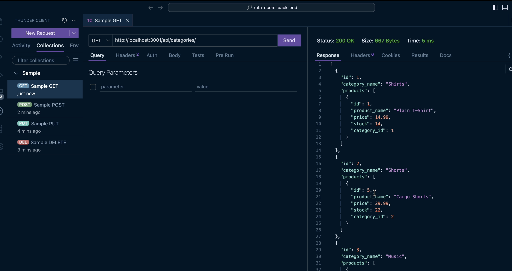

# rafa-ecom-back-end

## Description

The goal of this project is to create an ecommerce back end. The back end allows to view products, categories, and tags. A product includes its associated tags and a tag includes its associated products. Additionally, post, update, and delete routes are also availables for product, tag, or category.

## Installation

run "npm i" in the console to install the required packages. Include username and password in .env file.

## Usage

This is a ecom back end program. it allows users to view, post, update, and delete products, categories, and tags.

NOTE: Don't forget to add your MySQL username and password in a .env file.

## [Link to ecom-back-end demo video](https://drive.google.com/file/d/1Ff0Tk79rUUbNQ9ms7dB5aqcssO4Z2qgE/view?usp=share_link)

## Screenshot of application




## Credits

N/A

## License

This project uses the MIT license.

## Badges


## Features
```md
- View products, categories, and tags.
- View prodcuts with its associated tags, and view tags with its associated products.
- Post, update, and delete products, categories, and tags.
```